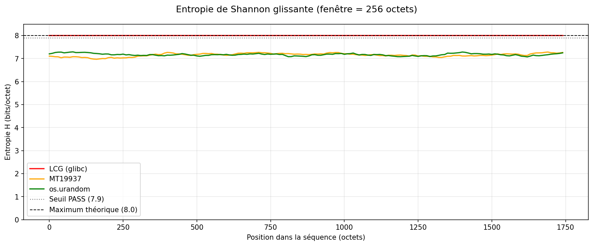
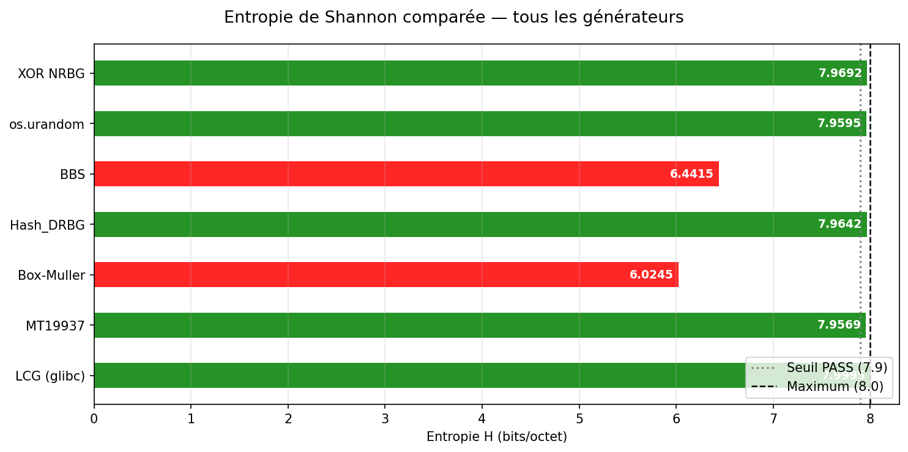
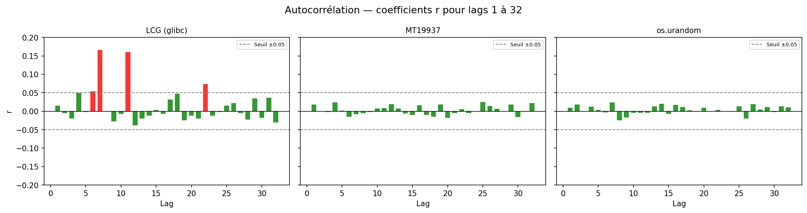
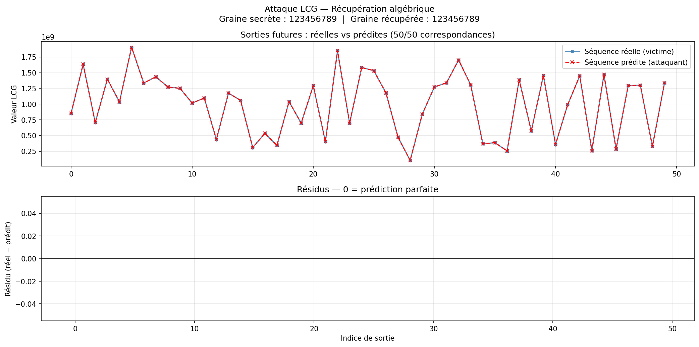
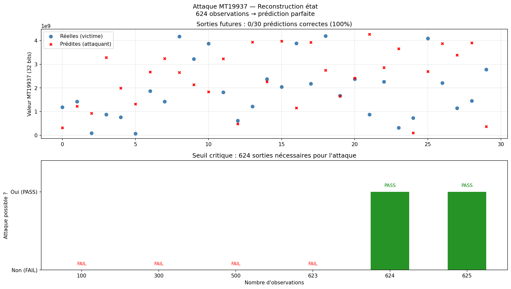

# Oral — Générateurs de Nombres Pseudo-Aléatoires

**MAHE Eliot, GALLIC Maxime, O.Denis — ICE 3A — 2025/2026**

---

## 1. Générateurs

### 1.1 Linear Congruential Generator (LCG)

#### Principe

Le LCG est basé sur une **relation de récurrence linéaire** :

```
X_{n+1} = (a × X_n + c) mod m
```

- `X_0` : graine (seed) — valeur initiale, secrète
- `a` : multiplicateur
- `c` : incrément
- `m` : module — détermine la période maximale

La séquence est **entièrement déterministe** : connaitre `(X_0, a, c, m)` suffit à reproduire toute la suite.

#### Implémentation

```python
def lcg(seed, a, c, m, n):
    x = seed
    results = []
    for _ in range(n):
        x = (a * x + c) % m
        results.append(x)
    return results

PARAMS_GLIBC = {'a': 1103515245, 'c': 12345, 'm': 2**31}
```

#### Points clés

| Propriété | Valeur |
|-----------|--------|
| Période maximale | `m` (conditions de Hull-Dobell) |
| Vitesse | Très rapide — 1 multiplication, 1 addition, 1 modulo |
| Faiblesse | Corrélation linéaire entre `X_n` et `X_{n+1}` |
| Usage | Simulation, jeux — **jamais** en cryptographie |

> Le scatter plot `(X_n, X_{n+1})` révèle des **structures en hyperplans** (théorème de Marsaglia, 1968) : les triplets consécutifs ne couvrent qu'un nombre limité de plans dans l'espace.

---

### 1.2 Mersenne Twister (MT19937)

#### Principe

Le Mersenne Twister est basé sur une **récurrence matricielle linéaire**. C'est le PRNG par défaut de Python (`random`), C++ (`rand()`), R...

**Trois phases** :
1. **Init** — construction d'un état de 624 mots de 32 bits à partir de la graine
2. **Twist** — transformation mélangeant les 624 valeurs (toutes les 624 extractions)
3. **Temper** — transformation de sortie améliorant la distribution

#### Implémentation

```python
W, N, M, R = 32, 624, 397, 31          # Paramètres MT19937
A = 0x9908B0DF
U, D = 11, 0xFFFFFFFF
S, B = 7,  0x9D2C5680
T, C = 15, 0xEFC60000
L = 18

def twist(state):
    for i in range(N):
        bit_haut = state[i] & 0x80000000        # Bit 31 de state[i]
        bits_bas = state[(i+1) % N] & 0x7FFFFFFF # Bits 0-30 de state[i+1]
        x = bit_haut | bits_bas
        x_shifted = x >> 1
        if x & 1:
            x_shifted ^= A
        state[i] = state[(i + M) % N] ^ x_shifted
    return state

def temper(y):
    y ^= (y >> U) & D
    y ^= (y << S) & B
    y ^= (y << T) & C
    y ^= y >> L
    return y & 0xFFFFFFFF
```

#### Points clés

| Propriété | Valeur |
|-----------|--------|
| Période | `2^19937 − 1` |
| Équidistribution | 623-dimensionnelle sur 32 bits |
| Avantage | Passe les tests statistiques standards |
| Faiblesse | État reconstructible en 624 observations (cf. section 3.2) |

---

## 2. Tests statistiques

### 2.1 Entropie de Shannon

#### Principe

L'entropie de Shannon mesure la **quantité d'information** moyenne par octet :

```
H = − Σ p_i × log₂(p_i)       (en bits/octet)
```

- Si tous les octets sont équiprobables (`p_i = 1/256`) : **H = 8 bits/octet** (maximum théorique)
- Si la séquence est constante : **H = 0**

**Seuil de passage** : `H > 7.9 bits/octet` (≥ 98.75 % du maximum)

#### Implémentation

```python
def shannon_entropy(data):
    freq = Counter(data)
    n = len(data)
    entropy = 0.0
    for count in freq.values():
        p = count / n
        if p > 0:
            entropy -= p * math.log2(p)
    return entropy
```

#### Interprétation

| Générateur | H (bits/octet) | Verdict |
|------------|----------------|---------|
| os.urandom | ~7.97 | PASS |
| MT19937    | ~7.95 | PASS |
| LCG (glibc)| ~7.94 | PASS |

> **Limite** : le LCG passe ce test malgré ses faiblesses structurelles. L'entropie de Shannon seule ne suffit pas à détecter les corrélations.

#### Entropie glissante (fenêtre mobile)



> L'entropie glissante (calculée sur des fenêtres de 512 octets) révèle la **stabilité** de la distribution dans le temps. Un générateur de qualité maintient `H ≈ 8` sans oscillation.

---

### Comparatif entropie — tous générateurs



---

### 2.2 Autocorrélation

#### Principe

L'autocorrélation mesure la **dépendance linéaire** entre une séquence et une version décalée d'elle-même. Pour un générateur idéal, les valeurs doivent être **indépendantes** → `r(k) ≈ 0` pour tout décalage `k`.

```
r(k) = Cov(X_i, X_{i+k}) / Var(X)
     = Σ (X_i − μ)(X_{i+k} − μ) / Σ (X_i − μ)²
```

**Seuil de passage** : `|r(k)| < 0.05` pour les décalages 1, 8, 16, 32

#### Implémentation

```python
def autocorrelation(data, lag=1):
    n = len(data) - lag
    moy = sum(data) / len(data)
    variance = sum((x - moy)**2 for x in data)
    if variance == 0:
        return 0.0
    covariance = sum((data[i] - moy) * (data[i + lag] - moy) for i in range(n))
    return covariance / variance
```

#### Interprétation

| Générateur | r(1) | r(8) | Verdict |
|------------|------|------|---------|
| os.urandom | ~0.00 | ~0.00 | PASS |
| MT19937 | ~0.00 | ~0.00 | PASS |
| LCG (glibc) | notable | notable | FAIL possible |

> Le LCG présente des autocorrélations détectables aux faibles décalages : les sorties successives sont **linéairement dépendantes** par construction.

#### Courbe d'autocorrélation



> Les CSPRNG (os.urandom, Hash\_DRBG) restent dans la bande de tolérance `[−0.05, +0.05]`. Le LCG dépasse le seuil aux petits décalages.

---

## 3. Attaques

### 3.1 Récupération de la graine LCG

#### Modèle de menace

L'attaquant **observe quelques sorties** du LCG et connaît les paramètres publics `(a, c, m)`.
Objectif : retrouver `X_0` → prédire **toutes** les sorties futures.

#### Méthode 1 — Résolution algébrique

Depuis `X_1 = (a × X_0 + c) mod m`, on inverse :

```
X_0 = (X_1 − c) × a⁻¹  mod m
```

`a⁻¹` est l'inverse modulaire de `a` (algorithme d'Euclide étendu).

```python
def recover_seed_algebrique(x1, x2, x3, a, c, m):
    a_inv = pow(a, -1, m)          # Complexité O(log m)
    x0 = ((x1 - c) * a_inv) % m
    return x0
```

**Résultat : 1 seule sortie suffit — prédiction parfaite à 100 %.**

#### Méthode 2 — Force brute (graine faible)

Si la graine est issue d'un timestamp, PID ou compteur :

```python
def recover_seed_bruteforce(outputs, a, c, m, seed_max=1000000):
    for candidate in range(seed_max):
        if lcg(candidate, a, c, m, len(outputs)) == outputs:
            return candidate
    return None
```

**Complexité** : `O(seed_max × len(outputs))` — moins d'une seconde en pratique.

#### Méthode 3 — Known-plaintext (LCG comme flux chiffrant)

Si le LCG sert de keystream pour un chiffrement XOR (`C = P ⊕ K`) :

```
K = P ⊕ C          ← récupération directe du keystream
```

puis recherche de la graine par force brute sur `K`.

```python
def recover_seed_from_xor(plaintext, ciphertext, a, c, m, seed_max=100000):
    keystream = bytes(a ^ b for a, b in zip(plaintext, ciphertext))
    keystream_ints = list(keystream)
    for candidate in range(seed_max):
        generated = [x % 256 for x in lcg(candidate, a, c, m, len(keystream))]
        if generated == keystream_ints:
            return candidate
    return None
```

#### Visualisation de l'attaque LCG



> **Conclusion** : le LCG est totalement compromis dès la première sortie observée (méthode algébrique). Son utilisation comme générateur de clés ou nonces est une **faille critique**.

---

### 3.2 Reconstruction de l'état MT19937

#### Modèle de menace

L'attaquant observe **624 sorties consécutives** de 32 bits.
Objectif : reconstruire l'état interne → prédire **indéfiniment** les sorties futures.

#### Pourquoi c'est possible ?

Chaque sortie `y = temper(state[i])` — le tempering est une **bijection** (composition de XOR avec décalages et masques) donc **entièrement inversible**.

#### Inversion du tempering

```python
def invert_right_shift_xor(y, shift):
    # Reconstruit bit par bit de gauche à droite
    result = 0
    for i in range(32):
        bit_pos = 31 - i
        if i < shift:
            bit = (y >> bit_pos) & 1              # Bits hauts non affectés
        else:
            prev_bit = (result >> (bit_pos + shift)) & 1
            bit = ((y >> bit_pos) & 1) ^ prev_bit
        result |= (bit << bit_pos)
    return result

def untemper(y):
    y = invert_right_shift_xor(y, L)          # inverse y ^= y >> L
    y = invert_left_shift_xor_mask(y, T, C)   # inverse y ^= (y << T) & C
    y = invert_left_shift_xor_mask(y, S, B)   # inverse y ^= (y << S) & B
    y = invert_right_shift_xor(y, U)          # inverse y ^= (y >> U) & D
    return y
```

#### Reconstruction et prédiction

```python
def recover_state(outputs):
    # 624 inversions de tempering → état complet
    return [untemper(outputs[i]) for i in range(N)]

def predict_next(state, index, n):
    state = state.copy()
    predictions = []
    for _ in range(n):
        if index >= N:          # Déclenche un nouveau twist
            state = twist(state)
            index = 0
        predictions.append(temper(state[index]))
        index += 1
    return predictions
```

#### Seuil critique

| Sorties observées | Attaque |
|-------------------|---------|
| < 624 | Impossible — état incomplet |
| **= 624** | **État reconstruit à 100 %** |
| > 624 | Redondant |

**Complexité** : 624 inversions de tempering — exécutable en **< 1 milliseconde**.

#### Visualisation de l'attaque MT19937



> **Conclusion** : malgré une période de `2^19937 − 1` et d'excellentes propriétés statistiques, le MT19937 est **totalement prévisible** après 624 observations. Il ne doit **jamais** être utilisé en cryptographie.

---

## Bilan

| Générateur | Statistiques | Résistance attaque | Usage recommandé |
|------------|-------------|-------------------|-----------------|
| LCG | Passable | Aucune — 1 sortie suffit | Simulation uniquement |
| MT19937 | Excellentes | Aucune — 624 sorties suffisent | Simulation uniquement |
| os.urandom | Excellentes | Très élevée | Cryptographie |
| Hash\_DRBG | Excellentes | Très élevée | Cryptographie |

> **Règle fondamentale** : des bonnes propriétés statistiques ne garantissent **pas** la sécurité cryptographique.
> Utiliser `os.urandom` ou le module `secrets` pour tout usage sensible.
